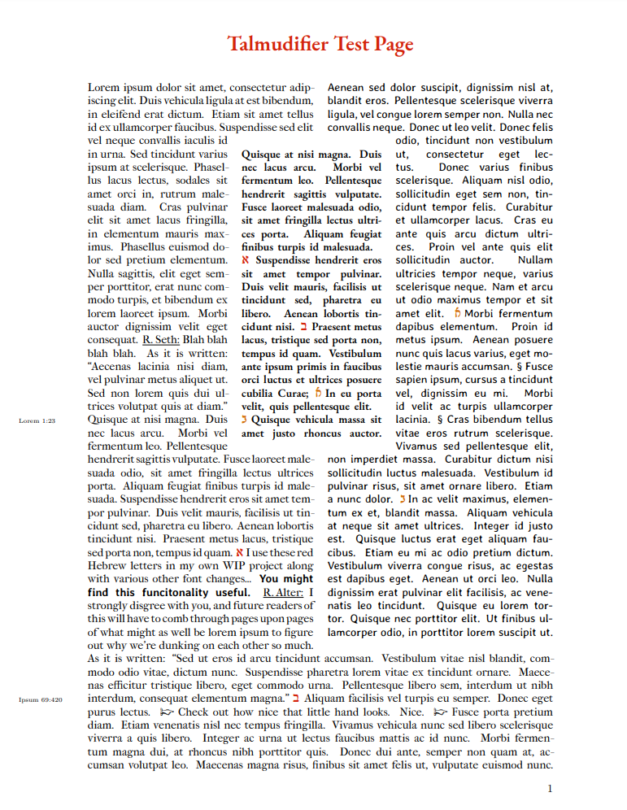

# talmudifier

**Please help me improve this README.** I wrote this README initially just so that _I_ could remember how the program works. There's probably a lot missing, and a lot that is very misleading... So, please email me with suggestions for improving the documentation (or, better yet, create a GitHub Issue if you know how).

**What this project does:** Given three sections of markdown-formatted text, generate a pdf that arranges the text in columns formatted like a page of the Talmud. 



That .PDF was generated from this input file:

<details>

```
# Left

`Lא` What is the left column? <u>R. Seth:</u> This is the redaction of the words of the rabbis and sages, who interpret the center text. <u>R. Alter:</u> The rabbis never agree on anything. I think that the left column is the "oral tradition", given to us in parallel with the primary text. So there! When you see the following special symbol, it's time to make a decision. -> _Inscribe:_ **The center column is primary.** _or_ **The left column is the oral center column.** `Lב` <u>R. Alter:</u>  And another thing! Sometimes we have a lot to argue about, and we end up citing verses, as it is written: "Blah blah blah thus saith Asherah our queen."`=Lorem&1:23` <u>R. Seth:</u> I'm just going to fill up a lot of space now by citing another text: "Lorem ipsum dolor sit amet, consectetur adipiscing elit. Fusce faucibus enim semper tincidunt varius. Nam et mi lacus. Sed commodo leo consectetur, imperdiet neque eget, aliquet felis. Etiam elit nulla, malesuada vitae dolor eget, tincidunt pharetra tellus a. Nunc eget convallis nunc, in faucibus ante. Sed dictum varius neque commodo hendrerit. Sed maximus ligula nunc, et tristique sapien faucibus et. Donec dictum turpis ac odio rhoncus consequat. Pellentesque metus nisi, sodales ut vestibulum vitae, convallis eget purus. Nulla lectus lacus, dapibus at molestie mattis, placerat non purus. Sed ac pharetra neque. Sed accumsan libero non sollicitudin faucibus. Integer a urna tortor. Proin quis volutpat turpis. Cras consectetur quam mauris, vitae feugiat ipsum sollicitudin at. Duis non imperdiet diam. Suspendisse laoreet venenatis metus sed porta. Nullam vel leo turpis. Vivamus id lacinia turpis, lacinia mattis libero. Proin fermentum, quam a rhoncus ornare, leo turpis facilisis leo, sit amet consectetur purus nulla non leo. Ut volutpat, nunc eu viverra dictum, sapien quam porta tellus, vel viverra diam erat at mi. Maecenas pellentesque mattis nibh in consequat. Donec mollis, ex a ullamcorper consectetur, diam leo aliquet leo, eu interdum tortor velit in magna."`=Ipsum&69:420` Does that clarify anything for you? -> _Inscribe:_ **R. Seth helped me understand.** _or_ **That last proof-text was gibberish.**

# Center

This is the center column of text. It is a slightly bigger font, and contains the "primary story". Occasionally, sentences end with citation notes. `Lא` Citations that are block Hebrew letters direct the reader to the left column. `Lב` Citations that are Rashi Hebrew characters direct the reader to the right column. `Rא`In the markdown, this is handled by adding a L or R to the citation character, e.g. R-aleph. `Rב` This column has the largest font. Some words, such as **Asherah** are always rendered in smallcaps.

# Right

`Rא` If **The center column is primary:**  This column is an interpretation of the center column based on previous interpretations you made having read the left column of rabbinical commentary. In this manner, you can participate in the rabbinical discourse. Or perhaps you're actually providing a third layer, rather than adding to the second? Either way, this is where the narrative "branches". Only it doesn't really branch because, of course,  you aren't affecting the center column at all. Rather, this column tends to answer questions of "why something happened" or "in what manner did something happen", and those answers are branched. | If **The left column is the oral center column:** You're not really _any_ steps  removed from the center column, because without a reader, the center column is just ink on a page. The implications of your previous thoughts are inextricably linked to how you have, are, and will read the center text. And so on and so forth. `Rב` If **R. Seth helped me understand:** Typically, the right column won't offer answers based on inscriptions you make on the same page. Rather, the bolded conditionals tend to be things you wrote down on _previous_ pages, such that previous readings inspire later readings. But since this is the only page in this test, that is of course impossible! So instead we'll work with what we got. | If **That last proof-text was gibberish:** Sure, but in order to test the layout, I need more words, so here's a few more: Praesent vitae mi mi. Sed viverra nibh turpis, non vulputate tellus tincidunt nec.
```

</details>

You can apply different styles and options to each column with a _recipe_ file (a default file is included in this repo).

**This script will take a while to run.** The size and positions of each column are calculated by repeatedly generating a test .PDF file. Expect the entire process to require approximately 5 minutes per page.

## Requirements

- Windows, OS X, or Linux
- Python 3.6 or 3.7
- XeLaTeX
  - marginnote
  - sectsty
  - ragged2e
  - lineno
  - xcolor
  - paracol
  - fontspec
  - scrbook

If you're not sure how to install anything and Google isn't being helpful, you can email me.

 ## Setup

 1.

 ```bash
 cd <where this folder is>/talmudifier
 ```

 Example: If your user name is Bob and you put this file in Downloads, type

 `cd C:/Users/Bob/Downloads/talmudifier`

2.

```bash
pip3 setup.py -e .
```

Don't forget the `.` at the end!

3.

```bash
python3 test_input_reader.py
```

You don't _need_ to do step 3, but if this test script works, then everything is set up OK.

## Usage

Talmudifier requires three sources of markdown text. It doesn't care where the sources come from (as long as they are imported correctly.

```python
left = "This is one source of text."
center = "This is another source of text."
right = "To be honest, you'll need a lot more words per column for this to work right."
```

Or just pull the text from three files, e.g.:

```python
import io

with io.open("left.txt", encoding="utf-8", "rt") as f:
    left = f.read()
```

Then import Talmudifier and generate a .pdf:

```
from talmudifier.talmudifier import Talmudifier

t = Talmudifier(left, center, right)
t.create_pdf()
```

## API

#### `Talmudifier`

Generate Talmud-esque page layouts, given markdown plaintext and a recipe JSON file.

```python
from talmudifier.talmudifier import Talmudifier

t = Talmudifier(left, center, right)
```

##### `__init__(self, text_left: str, text_center: str, text_right: str, recipe_filename="default.json")`

| Parameter | Description |
| --- | --- |
| text_left |  The markdown text of the left column.|
| text_center |  The markdown text of the center column.|
| text_right |  The markdown text of the right column.|
| recipe_filename |  The filename of the recipe, located in recipes/|

***

##### `get_tex(self) -> str`

Generate the body of text.
1. Create 4 rows on the left and right (width = one half).
2. Create 1 row on the left and right (width = one third).
3. Until the columns are all done: Find the shortest column and add it. Add other columns up to that length.

***

##### `get_chapter(self, title: str) -> str`

Returns the chapter command.

| Parameter | Description |
| --- | --- |
| title |  The title of the chapter.|

***

##### `create_pdf(self, chapter="", output_filename="output", print_tex=False) -> str`

Create a PDF. Generate the chapter and the body, and append them to the preamble. Returns the LaTeX string.

| Parameter | Description |
| --- | --- |
| chapter |  If not empty, create the header here.|
| output_filename |  The name of the output file.|
| print_tex |  If true, print the LaTeX string to the console.|

#### `PDFWriter`

Given LaTeX text, write a PDF. A `Talmudifier` object has its own writer, but it might be useful for you to create .pdfs manually (especially if you want to stitch a lot of .tex files together).

```python
from talmudifier.pdf_writer import PDFWriter

writer = PDFWriter(preamble)
```

##### `__init__(self, preamble: str)`

| Parameter | Description |
| --- | --- |
| preamble |  The preamble text.|

***

##### `write(self, text: str, filename: str) -> str`

Create a PDF from LaTeX text. Returns the LaTeX text, including the preamble and the end command(s).

| Parameter | Description |
| --- | --- |
| text |  The LaTeX text.|
| filename | The filename of the PDF. |

## Recipes

A recipe is a JSON file that defines the fonts and other styling rules for your page. It is functionally the same as just writing your own TeX preamble, but probably a lot more user-friendly.

By default, `talmudifier.py` uses: `recipes/default.json`.

All custom recipes should be saved to the `recipes/` directly as `.json` files.

### `fonts`

Definitions for the font per column.

```json
"fonts":
{
    "left":
    {
        
    }
}
```

_Key = The name of the font (left, center, right). Don't change these._

| Field              | Type       | Description                                                  | Required? |
| ------------------ | ---------- | ------------------------------------------------------------ | --------- |
| `path`             | string     | Path to the directory of fonts relative to `talmudifier.py`. | ✔         |
| `ligatures`        | string     | How ligatures are handled. This should probably always be `"TeX"`. There are other options, but the documentation for them is [sparse](https://tex.stackexchange.com/questions/296737/what-do-the-various-values-of-the-ligatures-option-of-fontspec-do). | ✔         |
| `regular_font`     | string     | The regular font file. Must be a file located in the directory `path`. | ✔         |
| `italic_font`      | string     | The _italic_ font file. Must be a file located in the directory `path`. | ❌         |
| `bold_font`        | string     | The **bold** font file. Must be a file located in the directory `path`. | ❌         |
| `bold_italic_font` | string     | The _**bold+italic**_ font file. Must be a file located in the directory `path`. | ❌         |
| `size`             | integer    | The font size. This will default to whatever the font size is in the `header.txt` preamble. If `skip` is not included, this is ignored. | ❌         |
| `skip`             | integer    | The size of the spacing between two lines. Generally you want this to be 2 more than `size`. If `size` is not included, this is ignored. | ❌         |
| `substitutions`    | dictionary | Per word in this column, replace every key in the dictionary with the value. | ❌         |
| `citation`         | dictionary | The recipe for citations _pointing to_ this column. See below. | ❌         |

#### `citation`

Citations are letters or words that direct the reader from column to column.

| Field          | Type              | Description                                                  | Required? |
| -------------- | ----------------- | ------------------------------------------------------------ | --------- |
| `path`         | string            | Path to the directory of fonts relative to `talmudifier.py`. | ✔         |
| `font`         | string            | The font file. Must be a file located in the directory `path`. | ✔         |
| `command`      | string            | The command used in the TeX document body to start the citation font. This can be the same as `font_command` but you might want to define a custom version. `default.json` _does_ have a custom version, that makes citations red-colored. | ✔         |
| `font_command` | string            | The command used to name the font family. You probably don't want to change this from `default.json`'s values. | ✔         |
| `pattern`      | string<br>(regex) | `talmudifier.py` will replace anything in the input string with this regex pattern with a properly-formatted citation letter. | ✔         |

### `character_counts`

These are the average number of characters in a column across many trials, given different column configurations (e.g. left and right only), a target column (e.g. left), and a target number of rows (e.g. 1).

`talmudifier.py` will use these numbers to fill columns with a "best guess" number of words before adding and subtracting words to reach a given row number target (e.g. if there are only left and right columns and you want 1 row on the left, `talmudifier.py` will first try to fill the row with 47 characters). If there is no key present, `talmudifier.py` will first look for the `"1"` key and multiply the value by the number of rows (e.g. 47 * 4). If there are no keys at all, `talmudifier.py` will just add a word at a time to the column (which is much slower).

You can calculate these values yourself by running `row_length_calculator.py`.

```json
  "character_counts":
  {
    "half":
    {
      "left":
      {
        "1": 47
      }
    }
  }
```

| Key      | Description                                                  |
| -------- | ------------------------------------------------------------ |
| `"half"` | The expected width of the column. Can be `"half"`, `"one_third"`, or `"two_thirds"`. |
| `"left"` | The target column within the table. Can be `"left"`, `"center"`, or `"right"`. |
| `"1"`    | The target number of rows. Must be an integer.<br>Value=The average number of characters across many trials. |

#### `row_length_calculator.py`

Use this script to calculate the average number of characters per row given a recipe, a list of tables, and a target column.

| Argument    | Type    | Description                                                  | Default        |
| ----------- | ------- | ------------------------------------------------------------ | -------------- |
| `--columns` | string  | The columns in the table. Can be `LCR`, `LR`, etc.           | `LR`           |
| `--target`  | string  | The target column. Can be `"left"`, `"center"`, or `"right"`. |                |
| `--rows`    | integer | The number of rows.                                          | `1`            |
| `--trials`  | integer | The number of trials to run and then average.                | `100`          |
| `--recipe`  | string  | Filename of the recipe file in the `recipes/` directory.     | `default.json` |

### `chapter`

Define the chapter header style.

| Field        | Type    | Description                                                  | Required? |
| ------------ | ------- | ------------------------------------------------------------ | --------- |
| `definition` | string  | The TeX definition of the command used to define the font. Sorry this is a bit of a mess. The parameter after `\newcommand` must match `\command` (see `default.json`). | ✔         |
| `command`    | string  | The command used when creating a chapter.                    | ✔         |
| `numbering`  | boolean | If true, chapter headers will start with numbers.            | ✔         |

### `colors`

Define colors for the preamble. The key is the name of the color, and the value is the HTML hex code. This can be left empty if you don't need any extra colors.

### `misc_definitions`

Anything else you'd like to include in the preamble. `default.json` includes the following:

- Definitions for left and right citation font commands; note how they include a color found in `colors`.
- Definition for `\flowerfont`, referred to in `recipe["fonts"]["left"]["substitutions"]`.